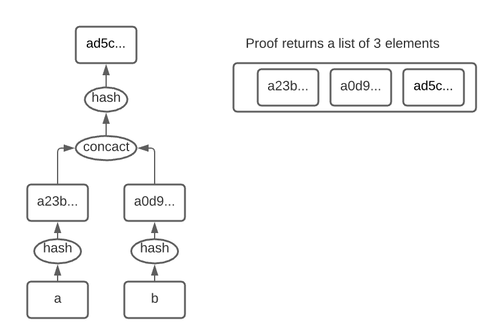

# Bulletin board demo

This is a proof of concept for a server implementing a bulletin board and providing
proofs of inclusion via Merkle trees.

There is a simple REST API with JSON encoding.

There is a simple html/javascript client provided for testing that uses the REST API. Associated files are in the WebResources folder.

## To run

* Make sure rust is installed on your computer.
* In this directory, execute `cargo run` which will download dependencies, compile, and run the server. You can stop it with control C.
* Open a web browser at http://localhost:8090

**Add an entry to the board** (http://localhost:8090/AddEntry.html) allows you to enter a series of strings.  When you click 'Build Merkle Tree', they are hashed and then incorporated as leaf nodes into a new Merkle Tree.  

**Get a proof of inclusion** (http://localhost:8090/Proof.html) takes an index (of a leaf) and returns a vector of sibling hashes in the most recently built tree.

Each new Merkle tree is built separately.

A new API based on querying for hashes rather than indices is under development and is partway implemented. 
It also deals with timestamps and prior published trees, and does not have a second gratuitous hashing for leaves.

It saves and loads data from the directory "csv_database". 
The files in there are human readable.

## Understanding

The general theory can be found here https://sites.google.com/site/certificatetransparency/log-proofs-work.

The following diagram shows the state of Merkle Tree after the inclusion of "a" and "b".

