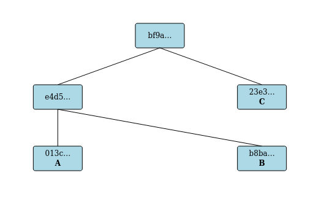
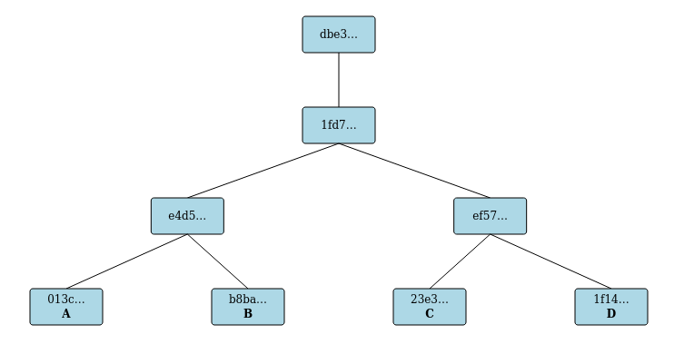

# Merkle tree Bulletin board library and demo

This repository contains:
* merkle-tree-bulletin-board : A general purpose library for implementing a bulletin 
  board and providing proofs of inclusion via Merkle trees.  
* bulletin-board-demo : A demo webserver with a thin wrapper around the main functionality
  provided by the above library with html files explaining the proof in detail and
  showing the trees graphically. This is not intended for production, but rather to 
  show an example of how to use the library. 
* merkle-tree-bulletin-board-backend-mysql : A demo (usable) mysql backend for the
  merkle-tree-bulletin-board.

# What does it do?

There is a common addage "trust, but verify." Unfortunately, it is often impossible to verify,
so if you are on the other end of this addage you should "be trustworthy, but be verifiable." 
This is designed to help a trustworthy bulletin board be verifiable.

Specifically, it allows for the continuous additions of elements to the bulletin board. Periodically,
the bulletin board publishes a hashcode that is a commitment to all the elements published
to date. Everyone can call their friends and check that everyone is being told the same hash, as
evidence that everyone is being shown the same bulletin board. Anyone can check that any specific
entry is referenced by said hash, and it is also possible to download the entire board (or additions
since the last published hash) and check that is compatible with the provided hash.

This gives everyone confidence that the bulletin board operator is actually trustworthy. Or they
have worked out how to reverse SHA2, which is considered hard. For a comparable definition of hard
to "achieving world peace, prosperity and universal love" is hard.

## How is this different from just publishing a file of all the entries, and publishing a hash of said file?

That solves a very similar problem in a simpler manner, and is preferable except for a couple
of advantages of this approach:
* The Merkle tree lets one check that their own contribution is in the tree without having
  to download the entire bulletin board, in fact in time logarithmic in the size of the bulletin
  board.
* The operator may choose to refuse to give details on part of the tree *after* publishing
  a hash, without harming the verification of the rest of the tree. This is essential to
  be able to support censorship of the board, which is a legal requirement in much of
  the world. Assume standard rant about how biased such laws tend to be against things that would
  embarrass the powers that be. The operator can't hide the fact that something has been 
  censored.
  
# How to use, compile, etc.

This is a rust library. Make sure rust is installed on your computer. Version 1.54 or later is
recommended.

## To run the demo server.

* Make sure rust is installed on your computer.
* In this directory, execute `cargo run` which will download dependencies, compile, and run the server. You can stop it with control C.
* Open a web browser at http://localhost:8090

**Add an entry to the board** (http://localhost:8090/AddEntry.html) allows you to enter a series of strings, getting in
     response a hash value. The board is committing to include that hash value in the next published Merkle tree.
     Add at least one. The corresponding hash will appear in the status, with a link.

**Publish a new root**
     When you click 'Publish new root', they are hashed and then incorporated as leaf nodes into a new Merkle Tree. All prior
     entries are included.

**Get a proof of inclusion** Open (preferably in a new tab) one of the links for the hash values obtained for a string you entered.
     This gives information about that hash value, and how to rederive it yourself. Click on 'Show Full Text Inclusion Proof' to
      get a detailed proof linking your entered node to the newly published root.

It saves and loads data from the human readable text file `database.csv` 
and stores journals (transactions between published roots) in the `journal` directory in the same format.

## Rust docs

There is a simple REST API with JSON encoding. Run `cargo doc --no-deps` to generate rust docs -
the API is a simple wrapper around the functions described in `target/doc/merkle_tree_bulletin_board/struct.BulletinBoard.html`

## To use in your own system

You will probably want to use the library in merkle-tree-bulletin-board and make your own server and backend.
This can be done from this API or from crates.io (TODO). 

The main API is from the BulletinBoard structure.

### Backend

The bulletin board needs to store its information somewhere. There are a variety of
ways of doing this, abstracted into a Backend. You can pretty easily write your own, or
there are a variety of backends available:
* BackendMemory : Store everything transiently in memory. Good for tests and API demos.
* BackendFlatfile : like BackendMemory, but with flatfile persistent storage. Good for prototyping, but not suitable for production. This is used for the demo web server.
* BackendJournal : A wrapper around some other Backend that adds persistent storage of the changes between publications. Useful for adding bulk download support to some other backend.
* BackendMysql : This is in the merkle-tree-bulletin-board-backend-mysql folder. An example (usable) backend for a mysql or mariadb database. This could easily be adapted to a different SQL database.

# How it works

See [Wikipedia](https://en.wikipedia.org/wiki/Merkle_tree) 
or [Google](https://sites.google.com/site/certificatetransparency/log-proofs-work)
for the general theory.

Different problems have somewhat different details depending upon their specific requirements.
For the bulletin board, we want the additions of items to be an ongoing process, with occasional
publications not synchronized to the additions. In particular, we can't assume a power of two
entries on the board. We also record the text of the items rather than just their hash.

There are three different types of node in the system:
* Leaves. Each entry on the bulletin board is a leaf. Hash is of `0|timestamp|entry`
* Branches. Each branch contains a left and right node, which may be a branch or a leaf. 
  Everything on the left side of a branch precedes chronologically everything on the right side of
  a branch. Both sides of a branch will be perfect binary trees of the same depth. Each leaf and
  branch will have a maximum of 1 parent. Hash is of `1|left|right`
* Published roots. When a publication is done, a published root node is created which
  contains the hash of the prior published root, if any, and all the currently parentless
  leaves and branches, of which there will be O(log N) where N is the number of leaves.
  Hash is of `2|timestamp|prior|elements concatenated`
  
See hash_history.rs for precise description of the hash definitions.
  
Each time an entry is added, a new leaf is created. This is appended to a pending list of trees.
(a leaf is considered a tree of depth 0). 
If the last two entries in the pending list have the same depth, then a new branch is created from
those two, and replaces them on the pending list. This is continued recursively until the last two
entries in the pending list are different depth (or there is only one entry in the list).
This list will never get longer than 1+log base 2 of N, where N is the number of leaves.

This pending list contains the list of leaves and branches that have no parents; a published
root is really a list of these elements. This means publishing a root hash is a relatively
minor operation, very similar to a git commit object.

## Example

The following picture from the demo shows the status after submitting three entries, A, B, and C, and
then publishing a root.

* The A produced a leaf with hash 013c...
* The B produced a leaf with hash b8ba...
* A and B were then merged into a branch with hash e4d5...
* The C produced a leaf with hash 23e3...
* Publication produced a published root with hash bf9a... that referenced the branch e4d5... and leaf 23e3...

Then an extra entry "D" was submitted and a new publication was done.

* The D produced a leaf with hash 1f14...
* The C and D were merged into a branch with hash ef57...
* The AB and CD branches were merged into a branch with hash 1fd7...
* Publication produced a published root with hash dbe3... that referenced the branch 1fd7...

Note that if you do the same with the demo you will get different hash values as timestamps are included.
